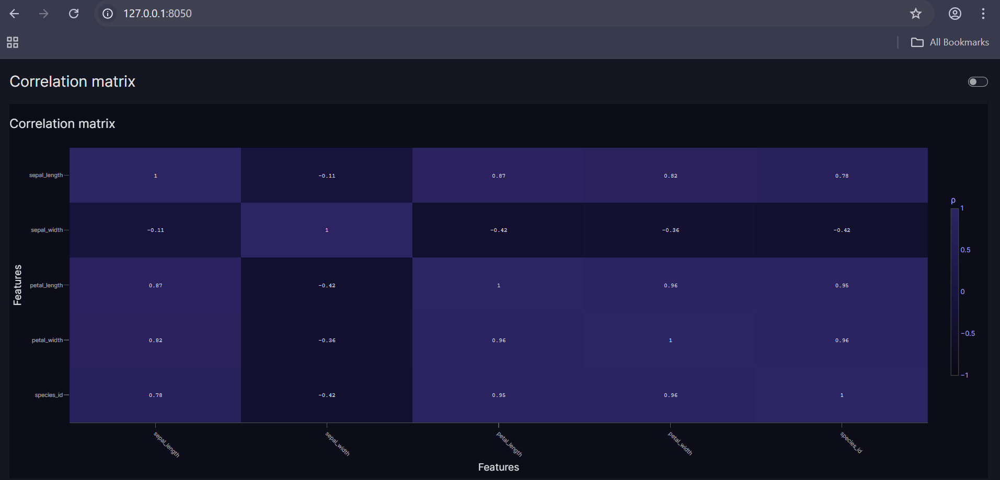

Contributed a pull request to add a correlation matrix visualisation to Vizro's Visual Vocabulary project. 

https://github.com/mckinsey/vizro/pull/1511

This repo is an upload of the code submitted. 

App.py [VIS]:

